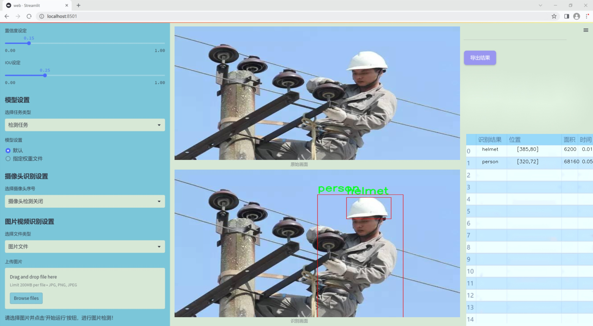
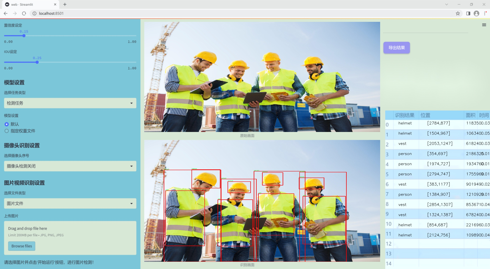
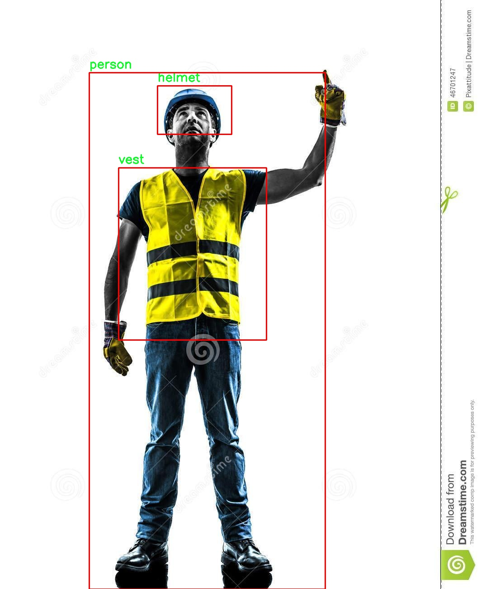
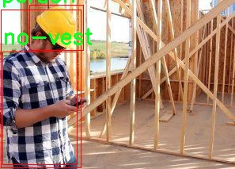
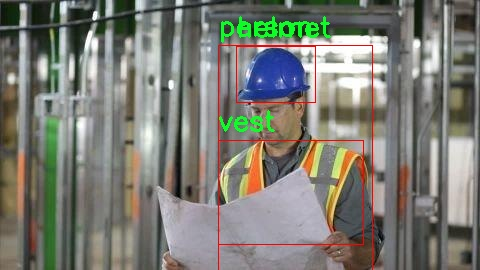
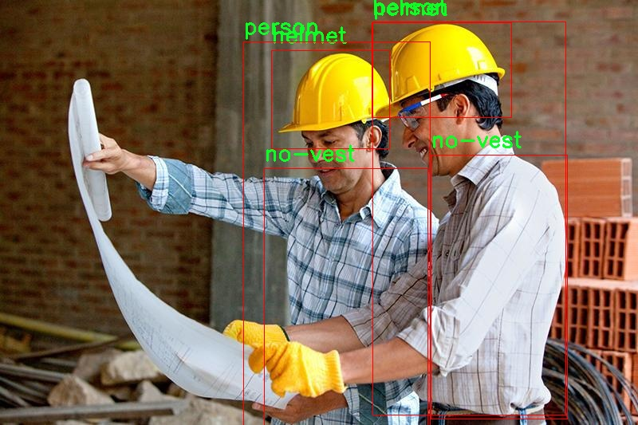

# 改进yolo11-goldyolo等200+全套创新点大全：施工安全防护装备检测系统源码＆数据集全套

### 1.图片效果展示






##### 项目来源 **[人工智能促进会 2024.10.24](https://kdocs.cn/l/cszuIiCKVNis)**

注意：由于项目一直在更新迭代，上面“1.图片效果展示”和“2.视频效果展示”展示的系统图片或者视频可能为老版本，新版本在老版本的基础上升级如下：（实际效果以升级的新版本为准）

  （1）适配了YOLOV11的“目标检测”模型和“实例分割”模型，通过加载相应的权重（.pt）文件即可自适应加载模型。

  （2）支持“图片识别”、“视频识别”、“摄像头实时识别”三种识别模式。

  （3）支持“图片识别”、“视频识别”、“摄像头实时识别”三种识别结果保存导出，解决手动导出（容易卡顿出现爆内存）存在的问题，识别完自动保存结果并导出到tempDir中。

  （4）支持Web前端系统中的标题、背景图等自定义修改。

  另外本项目提供训练的数据集和训练教程,暂不提供权重文件（best.pt）,需要您按照教程进行训练后实现图片演示和Web前端界面演示的效果。

### 2.视频效果展示

[2.1 视频效果展示](https://www.bilibili.com/video/BV1Wi1hYUEtu/)

### 3.背景

研究背景与意义

随着全球建筑行业的快速发展，施工现场的安全问题日益突出。根据统计数据，施工现场的事故率高于其他行业，尤其是在高风险的建筑项目中，工人因缺乏必要的安全防护装备而遭受伤害的情况屡见不鲜。为了解决这一问题，施工安全防护装备的有效检测与管理显得尤为重要。传统的人工巡查方式不仅效率低下，而且容易受到人为因素的影响，无法及时发现安全隐患。因此，基于计算机视觉的自动化检测系统应运而生，成为提升施工安全管理水平的重要手段。

在此背景下，YOLO（You Only Look Once）系列目标检测模型因其高效性和实时性而备受关注。YOLOv11作为该系列的最新版本，具备更强的特征提取能力和更快的处理速度，能够在复杂的施工环境中实现对安全防护装备的精准识别。针对施工现场的特点，我们构建了一个包含1200张图像的数据集，涵盖了“头盔”、“无头盔”、“无背心”、“人”和“背心”五个类别。这一数据集的设计旨在模拟真实施工场景中的各种情况，为模型的训练和测试提供丰富的样本。

通过改进YOLOv11模型，我们希望能够提升其在施工安全防护装备检测中的准确性和鲁棒性，从而实现对工人安全状态的实时监控。该系统的应用不仅能够有效降低施工现场的事故发生率，还能为建筑企业提供科学的安全管理依据，推动行业的安全文化建设。总之，基于改进YOLOv11的施工安全防护装备检测系统的研究，具有重要的理论价值和现实意义，将为建筑行业的安全管理提供新的技术支持。

### 4.数据集信息展示

##### 4.1 本项目数据集详细数据（类别数＆类别名）

nc: 5
names: ['helmet', 'no-helmet', 'no-vest', 'person', 'vest']


该项目为【目标检测】数据集，请在【训练教程和Web端加载模型教程（第三步）】这一步的时候按照【目标检测】部分的教程来训练

##### 4.2 本项目数据集信息介绍

本项目数据集信息介绍

本项目所使用的数据集名为“construction safety”，旨在为改进YOLOv11的施工安全防护装备检测系统提供高质量的训练数据。该数据集专注于施工现场的安全防护装备，涵盖了五个主要类别，分别是“helmet”（安全帽）、“no-helmet”（未佩戴安全帽）、“no-vest”（未佩戴安全背心）、“person”（人员）和“vest”（安全背心）。这些类别的选择不仅反映了施工现场常见的安全隐患，也为系统的训练提供了丰富的样本，以便更好地识别和分类不同的安全装备状态。

在数据集的构建过程中，研究团队注重数据的多样性和代表性，确保涵盖各种施工环境和不同的工作场景。数据集中的图像来源于真实的施工现场，涵盖了不同的天气条件、时间段以及不同类型的施工活动。这种多样性使得模型在训练过程中能够学习到更为广泛的特征，从而提高其在实际应用中的鲁棒性和准确性。

此外，数据集的标注工作由经验丰富的专业人员完成，确保每个类别的标注准确无误。这一过程不仅提高了数据集的质量，也为后续的模型训练奠定了坚实的基础。通过使用“construction safety”数据集，改进后的YOLOv11模型将能够有效识别施工现场的安全防护装备，进而提升施工安全管理水平，减少安全事故的发生。总之，该数据集在项目中扮演着至关重要的角色，为实现智能化的施工安全监测提供了必要的数据支持。










### 5.全套项目环境部署视频教程（零基础手把手教学）

[5.1 所需软件PyCharm和Anaconda安装教程（第一步）](https://www.bilibili.com/video/BV1BoC1YCEKi/?spm_id_from=333.999.0.0&vd_source=bc9aec86d164b67a7004b996143742dc)


[5.2 安装Python虚拟环境创建和依赖库安装视频教程（第二步）](https://www.bilibili.com/video/BV1ZoC1YCEBw?spm_id_from=333.788.videopod.sections&vd_source=bc9aec86d164b67a7004b996143742dc)

### 6.改进YOLOv11训练教程和Web_UI前端加载模型教程（零基础手把手教学）

[6.1 改进YOLOv11训练教程和Web_UI前端加载模型教程（第三步）](https://www.bilibili.com/video/BV1BoC1YCEhR?spm_id_from=333.788.videopod.sections&vd_source=bc9aec86d164b67a7004b996143742dc)


按照上面的训练视频教程链接加载项目提供的数据集，运行train.py即可开始训练



     Epoch   gpu_mem       box       obj       cls    labels  img_size
     1/200     20.8G   0.01576   0.01955  0.007536        22      1280: 100%|██████████| 849/849 [14:42<00:00,  1.04s/it]
               Class     Images     Labels          P          R     mAP@.5 mAP@.5:.95: 100%|██████████| 213/213 [01:14<00:00,  2.87it/s]
                 all       3395      17314      0.994      0.957      0.0957      0.0843

     Epoch   gpu_mem       box       obj       cls    labels  img_size
     2/200     20.8G   0.01578   0.01923  0.007006        22      1280: 100%|██████████| 849/849 [14:44<00:00,  1.04s/it]
               Class     Images     Labels          P          R     mAP@.5 mAP@.5:.95: 100%|██████████| 213/213 [01:12<00:00,  2.95it/s]
                 all       3395      17314      0.996      0.956      0.0957      0.0845

     Epoch   gpu_mem       box       obj       cls    labels  img_size
     3/200     20.8G   0.01561    0.0191  0.006895        27      1280: 100%|██████████| 849/849 [10:56<00:00,  1.29it/s]
               Class     Images     Labels          P          R     mAP@.5 mAP@.5:.95: 100%|███████   | 187/213 [00:52<00:00,  4.04it/s]
                 all       3395      17314      0.996      0.957      0.0957      0.0845


###### [项目数据集下载链接](https://kdocs.cn/l/cszuIiCKVNis)

### 7.原始YOLOv11算法讲解

YOLOv11是一种由Ultralytics公司开发的最新一代目标检测模型，以其增强的特征提取能力和更高的效率在计算机视觉领域引人注目。该模型在架构上进行了关键升级，通过更新主干和颈部结构，显著提高了对复杂视觉场景的理解和处理精度。YOLOv11不仅在目标检测上表现出色，还支持实例分割、图像分类、姿态估计和定向目标检测（OBB）等任务，展示出其多功能性。

与其前身YOLOv8相比，YOLOv11在设计上实现了深度和宽度的改变，同时引入了几个创新机制。其中，C3k2机制是对YOLOv8中的C2f的改进，提升了浅层特征的处理能力；C2PSA机制则进一步优化了特征图的处理流程。解耦头的创新设计，通过增加两个深度卷积（DWConv），提高了模型对细节的感知能力和分类准确性。

在性能上，YOLOv11m模型在COCO数据集上的平均精度（mAP）提高，并减少了22%的参数量，确保了在运算效率上的突破。该模型可以部署在多种平台上，包括边缘设备、云平台以及支持NVIDIA GPU的系统，彰显出卓越的灵活性和适应性。总体而言，YOLOv11通过一系列的创新突破，对目标检测领域产生了深远的影响，并为未来的开发提供了新的研究方向。


****文档**** ： _ _https://docs.ultralytics.com/models/yolo11/__

****代码链接**** ： _ _https://github.com/ultralytics/ultralytics__

******Performance Metrics******


​ ** **关键特性****

****◆**** ** **增强的特征提取能力**** ：YOLO11采用了改进的主干和颈部架构，增强了 ** **特征提取****
能力，能够实现更精确的目标检测和复杂任务的执行。

****◆**** ** **优化的效率和速度****
：YOLO11引入了精细化的架构设计和优化的训练流程，提供更快的处理速度，并在准确性和性能之间保持最佳平衡。

****◆**** ** **参数更少、精度更高****
：通过模型设计的改进，YOLO11m在COCO数据集上实现了更高的平均精度（mAP），同时使用的参数比YOLOv8m少22%，使其在计算上更加高效，而不牺牲准确性。

****◆**** ** **跨环境的适应性**** ：YOLO11可以无缝部署在各种环境中，包括边缘设备、云平台和支持NVIDIA
GPU的系统，确保最大的灵活性。

****◆**** ** **支持广泛任务****
：无论是目标检测、实例分割、图像分类、姿态估计还是定向目标检测（OBB），YOLO11都旨在应对一系列计算机视觉挑战。

****支持的任务和模式****


​YOLO11建立在YOLOv8中引入的多功能模型范围之上，为各种计算机视觉任务提供增强的支持:


​该表提供了YOLO11模型变体的概述，展示了它们在特定任务中的适用性以及与Inference、Validation、Training和Export等操作模式的兼容性。从实时检测到复杂的分割任务
，这种灵活性使YOLO11适用于计算机视觉的广泛应用。

##### yolov11的创新

■ yolov8 VS yolov11

YOLOv5，YOLOv8和YOLOv11均是ultralytics公司的作品，ultralytics出品必属精品。


​ **具体创新点** ：

**① 深度（depth）和宽度 （width）**

YOLOv8和YOLOv11是基本上完全不同。

**② C3k2机制**

C3k2有参数为c3k，其中在网络的浅层c3k设置为False。C3k2就相当于YOLOv8中的C2f。


​ **③ C2PSA机制**

下图为C2PSA机制的原理图。


​ **④ 解耦头**

解耦头中的分类检测头增加了两个 **DWConv** 。


▲Conv

    
    
    def autopad(k, p=None, d=1):  # kernel, padding, dilation
    
        """Pad to 'same' shape outputs."""
    
        if d > 1:
    
            k = d * (k - 1) + 1 if isinstance(k, int) else [d * (x - 1) + 1 for x in k]  # actual kernel-size
    
        if p is None:
    
            p = k // 2 if isinstance(k, int) else [x // 2 for x in k]  # auto-pad
    
    return p
    
    
    class Conv(nn.Module):
    
        """Standard convolution with args(ch_in, ch_out, kernel, stride, padding, groups, dilation, activation)."""
    
    
        default_act = nn.SiLU()  # default activation
    
    
        def __init__(self, c1, c2, k=1, s=1, p=None, g=1, d=1, act=True):
    
            """Initialize Conv layer with given arguments including activation."""
    
            super().__init__()
    
            self.conv = nn.Conv2d(c1, c2, k, s, autopad(k, p, d), groups=g, dilation=d, bias=False)
    
            self.bn = nn.BatchNorm2d(c2)
    
            self.act = self.default_act if act is True else act if isinstance(act, nn.Module) else nn.Identity()
    
    
        def forward(self, x):
    
            """Apply convolution, batch normalization and activation to input tensor."""
    
            return self.act(self.bn(self.conv(x)))
    
    
        def forward_fuse(self, x):
    
            """Perform transposed convolution of 2D data."""
    
            return self.act(self.conv(x))

▲Conv2d

    
    
    torch.nn.Conv2d(in_channels, out_channels, kernel_size, stride=1, padding=0, dilation=1, groups=1, bias=True, padding_mode='zeros')

▲DWConv

DWConv ** **代表 Depthwise Convolution（深度卷积）****
，是一种在卷积神经网络中常用的高效卷积操作。它主要用于减少计算复杂度和参数量。

    
    
    class DWConv(Conv):
    
        """Depth-wise convolution."""
    
    
        def __init__(self, c1, c2, k=1, s=1, d=1, act=True):  # ch_in, ch_out, kernel, stride, dilation, activation
    
            """Initialize Depth-wise convolution with given parameters."""
    
            super().__init__(c1, c2, k, s, g=math.gcd(c1, c2), d=d, act=act)


### 8.200+种全套改进YOLOV11创新点原理讲解

#### 8.1 200+种全套改进YOLOV11创新点原理讲解大全

由于篇幅限制，每个创新点的具体原理讲解就不全部展开，具体见下列网址中的改进模块对应项目的技术原理博客网址【Blog】（创新点均为模块化搭建，原理适配YOLOv5~YOLOv11等各种版本）

[改进模块技术原理博客【Blog】网址链接](https://gitee.com/qunmasj/good)


#### 8.2 精选部分改进YOLOV11创新点原理讲解

###### 这里节选部分改进创新点展开原理讲解(完整的改进原理见上图和[改进模块技术原理博客链接](https://gitee.com/qunmasj/good)【如果此小节的图加载失败可以通过CSDN或者Github搜索该博客的标题访问原始博客，原始博客图片显示正常】

### 动态蛇形卷积Dynamic Snake Convolution

参考论文： 2307.08388.pdf (arxiv.org)

血管、道路等拓扑管状结构的精确分割在各个领域都至关重要，确保下游任务的准确性和效率。 然而，许多因素使任务变得复杂，包括薄的局部结构和可变的全局形态。在这项工作中，我们注意到管状结构的特殊性，并利用这些知识来指导我们的 DSCNet 在三个阶段同时增强感知：特征提取、特征融合、 和损失约束。 首先，我们提出了一种动态蛇卷积，通过自适应地关注细长和曲折的局部结构来准确捕获管状结构的特征。 随后，我们提出了一种多视图特征融合策略，以补充特征融合过程中多角度对特征的关注，确保保留来自不同全局形态的重要信息。 最后，提出了一种基于持久同源性的连续性约束损失函数，以更好地约束分割的拓扑连续性。 2D 和 3D 数据集上的实验表明，与多种方法相比，我们的 DSCNet 在管状结构分割任务上提供了更好的准确性和连续性。 我们的代码是公开的。 
主要的挑战源于细长微弱的局部结构特征与复杂多变的全局形态特征。本文关注到管状结构细长连续的特点，并利用这一信息在神经网络以下三个阶段同时增强感知：特征提取、特征融合和损失约束。分别设计了动态蛇形卷积（Dynamic Snake Convolution），多视角特征融合策略与连续性拓扑约束损失。 

我们希望卷积核一方面能够自由地贴合结构学习特征，另一方面能够在约束条件下不偏离目标结构太远。在观察管状结构的细长连续的特征后，脑海里想到了一个动物——蛇。我们希望卷积核能够像蛇一样动态地扭动，来贴合目标的结构。

我们希望卷积核一方面能够自由地贴合结构学习特征，另一方面能够在约束条件下不偏离目标结构太远。在观察管状结构的细长连续的特征后，脑海里想到了一个动物——蛇。我们希望卷积核能够像蛇一样动态地扭动，来贴合目标的结构。


### DCNV2融入YOLOv11
DCN和DCNv2（可变性卷积）
网上关于两篇文章的详细描述已经很多了，我这里具体的细节就不多讲了，只说一下其中实现起来比较困惑的点。（黑体字会讲解）

DCNv1解决的问题就是我们常规的图像增强，仿射变换（线性变换加平移）不能解决的多种形式目标变换的几何变换的问题。如下图所示。

可变性卷积的思想很简单，就是讲原来固定形状的卷积核变成可变的。如下图所示：


首先来看普通卷积，以3x3卷积为例对于每个输出y(p0)，都要从x上采样9个位置，这9个位置都在中心位置x(p0)向四周扩散得到的gird形状上，(-1,-1)代表x(p0)的左上角，(1,1)代表x(p0)的右下角，其他类似。

用公式表示如下：


可变性卷积Deformable Conv操作并没有改变卷积的计算操作，而是在卷积操作的作用区域上，加入了一个可学习的参数∆pn。同样对于每个输出y(p0)，都要从x上采样9个位置，这9个位置是中心位置x(p0)向四周扩散得到的，但是多了 ∆pn，允许采样点扩散成非gird形状。


偏移量是通过对原始特征层进行卷积得到的。比如输入特征层是w×h×c，先对输入的特征层进行卷积操作，得到w×h×2c的offset field。这里的w和h和原始特征层的w和h是一致的，offset field里面的值是输入特征层对应位置的偏移量，偏移量有x和y两个方向，所以offset field的channel数是2c。offset field里的偏移量是卷积得到的，可能是浮点数，所以接下来需要通过双向性插值计算偏移位置的特征值。在偏移量的学习中，梯度是通过双线性插值来进行反向传播的。
看到这里是不是还是有点迷茫呢？那到底程序上面怎么实现呢？


事实上由上面的公式我们可以看得出来∆pn这个偏移量是加在原像素点上的，但是我们怎么样从代码上对原像素点加这个量呢？其实很简单，就是用一个普通的卷积核去跟输入图片（一般是输入的feature_map）卷积就可以了卷积核的数量是2N也就是23*3==18（前9个通道是x方向的偏移量，后9个是y方向的偏移量），然后把这个卷积的结果与正常卷积的结果进行相加就可以了。
然后又有了第二个问题，怎么样反向传播呢？为什么会有这个问题呢？因为求出来的偏移量+正常卷积输出的结果往往是一个浮点数，浮点数是无法对应到原图的像素点的，所以自然就想到了双线性差值的方法求出浮点数对应的浮点像素点。


#### DCN v2
对于positive的样本来说，采样的特征应该focus在RoI内，如果特征中包含了过多超出RoI的内容，那么结果会受到影响和干扰。而negative样本则恰恰相反，引入一些超出RoI的特征有助于帮助网络判别这个区域是背景区域。

DCNv1引入了可变形卷积，能更好的适应目标的几何变换。但是v1可视化结果显示其感受野对应位置超出了目标范围，导致特征不受图像内容影响（理想情况是所有的对应位置分布在目标范围以内）。

为了解决该问题：提出v2, 主要有

1、扩展可变形卷积，增强建模能力
2、提出了特征模拟方案指导网络培训：feature mimicking scheme

上面这段话是什么意思呢，通俗来讲就是，我们的可变性卷积的区域大于目标所在区域，所以这时候就会对非目标区域进行错误识别。

所以自然能想到的解决方案就是加入权重项进行惩罚。（至于这个实现起来就比较简单了，直接初始化一个权重然后乘(input+offsets)就可以了）


可调节的RoIpooling也是类似的，公式如下：


### 9.系统功能展示

图9.1.系统支持检测结果表格显示

  图9.2.系统支持置信度和IOU阈值手动调节

  图9.3.系统支持自定义加载权重文件best.pt(需要你通过步骤5中训练获得)

  图9.4.系统支持摄像头实时识别

  图9.5.系统支持图片识别

  图9.6.系统支持视频识别

  图9.7.系统支持识别结果文件自动保存

  图9.8.系统支持Excel导出检测结果数据


### 10. YOLOv11核心改进源码讲解

#### 10.1 UniRepLKNet.py

以下是对代码的核心部分进行的分析和详细注释。我们将保留主要的类和函数，并添加中文注释以帮助理解。

```python
import torch
import torch.nn as nn
import torch.nn.functional as F
from timm.layers import trunc_normal_, DropPath, to_2tuple
import torch.utils.checkpoint as checkpoint

class GRNwithNHWC(nn.Module):
    """ 
    GRN (Global Response Normalization) 层
    该层用于全局响应归一化，假设输入的形状为 (N, H, W, C)
    """
    def __init__(self, dim, use_bias=True):
        super().__init__()
        self.use_bias = use_bias
        self.gamma = nn.Parameter(torch.zeros(1, 1, 1, dim))  # 可学习参数
        if self.use_bias:
            self.beta = nn.Parameter(torch.zeros(1, 1, 1, dim))  # 可学习偏置

    def forward(self, x):
        Gx = torch.norm(x, p=2, dim=(1, 2), keepdim=True)  # 计算L2范数
        Nx = Gx / (Gx.mean(dim=-1, keepdim=True) + 1e-6)  # 归一化
        if self.use_bias:
            return (self.gamma * Nx + 1) * x + self.beta  # 应用归一化和偏置
        else:
            return (self.gamma * Nx + 1) * x

class DilatedReparamBlock(nn.Module):
    """
    Dilated Reparam Block
    该模块用于实现扩张卷积的重参数化
    """
    def __init__(self, channels, kernel_size, deploy, use_sync_bn=False, attempt_use_lk_impl=True):
        super().__init__()
        self.lk_origin = get_conv2d(channels, channels, kernel_size, stride=1,
                                     padding=kernel_size//2, dilation=1, groups=channels, bias=deploy,
                                     attempt_use_lk_impl=attempt_use_lk_impl)

        # 根据不同的kernel_size设置扩张卷积的参数
        if kernel_size == 17:
            self.kernel_sizes = [5, 9, 3, 3, 3]
            self.dilates = [1, 2, 4, 5, 7]
        # 其他kernel_size的情况省略...

        if not deploy:
            self.origin_bn = get_bn(channels, use_sync_bn)  # 获取批归一化层
            for k, r in zip(self.kernel_sizes, self.dilates):
                self.__setattr__('dil_conv_k{}_{}'.format(k, r),
                                 nn.Conv2d(in_channels=channels, out_channels=channels, kernel_size=k, stride=1,
                                           padding=(r * (k - 1) + 1) // 2, dilation=r, groups=channels,
                                           bias=False))
                self.__setattr__('dil_bn_k{}_{}'.format(k, r), get_bn(channels, use_sync_bn=use_sync_bn))

    def forward(self, x):
        if not hasattr(self, 'origin_bn'):  # 部署模式
            return self.lk_origin(x)
        out = self.origin_bn(self.lk_origin(x))
        for k, r in zip(self.kernel_sizes, self.dilates):
            conv = self.__getattr__('dil_conv_k{}_{}'.format(k, r))
            bn = self.__getattr__('dil_bn_k{}_{}'.format(k, r))
            out = out + bn(conv(x))  # 逐层相加
        return out

class UniRepLKNetBlock(nn.Module):
    """
    UniRepLKNet中的基本块
    """
    def __init__(self, dim, kernel_size, drop_path=0., layer_scale_init_value=1e-6, deploy=False,
                 attempt_use_lk_impl=True, with_cp=False, use_sync_bn=False, ffn_factor=4):
        super().__init__()
        self.with_cp = with_cp
        self.dwconv = DilatedReparamBlock(dim, kernel_size, deploy=deploy,
                                          use_sync_bn=use_sync_bn,
                                          attempt_use_lk_impl=attempt_use_lk_impl)
        self.norm = get_bn(dim, use_sync_bn=use_sync_bn)  # 获取批归一化层
        self.se = SEBlock(dim, dim // 4)  # Squeeze-and-Excitation模块

        ffn_dim = int(ffn_factor * dim)
        self.pwconv1 = nn.Sequential(
            NCHWtoNHWC(),
            nn.Linear(dim, ffn_dim))  # 逐点卷积
        self.act = nn.Sequential(
            nn.GELU(),
            GRNwithNHWC(ffn_dim, use_bias=not deploy))  # 激活函数和GRN层
        self.pwconv2 = nn.Sequential(
            nn.Linear(ffn_dim, dim, bias=False),
            NHWCtoNCHW(),
            get_bn(dim, use_sync_bn=use_sync_bn))  # 逐点卷积和批归一化

        self.gamma = nn.Parameter(layer_scale_init_value * torch.ones(dim),
                                  requires_grad=True) if (not deploy) and layer_scale_init_value is not None \
                                                         and layer_scale_init_value > 0 else None
        self.drop_path = DropPath(drop_path) if drop_path > 0. else nn.Identity()  # 随机深度

    def forward(self, inputs):
        def _f(x):
            y = self.se(self.norm(self.dwconv(x)))  # 经过SE模块和归一化
            y = self.pwconv2(self.act(self.pwconv1(y)))  # 逐点卷积和激活
            if self.gamma is not None:
                y = self.gamma.view(1, -1, 1, 1) * y  # 应用缩放
            return self.drop_path(y) + x  # 残差连接

        if self.with_cp and inputs.requires_grad:
            return checkpoint.checkpoint(_f, inputs)  # 使用检查点以节省内存
        else:
            return _f(inputs)

class UniRepLKNet(nn.Module):
    """
    UniRepLKNet模型
    """
    def __init__(self, in_chans=3, num_classes=1000, depths=(3, 3, 27, 3), dims=(96, 192, 384, 768),
                 drop_path_rate=0., layer_scale_init_value=1e-6, deploy=False, with_cp=False,
                 attempt_use_lk_impl=True, use_sync_bn=False):
        super().__init__()

        self.downsample_layers = nn.ModuleList()  # 下采样层
        self.downsample_layers.append(nn.Sequential(
            nn.Conv2d(in_chans, dims[0] // 2, kernel_size=3, stride=2, padding=1),
            LayerNorm(dims[0] // 2, eps=1e-6, data_format="channels_first"),
            nn.GELU(),
            nn.Conv2d(dims[0] // 2, dims[0], kernel_size=3, stride=2, padding=1),
            LayerNorm(dims[0], eps=1e-6, data_format="channels_first")))

        self.stages = nn.ModuleList()  # 各个阶段的模块
        cur = 0
        for i in range(4):
            main_stage = nn.Sequential(
                *[UniRepLKNetBlock(dim=dims[i], kernel_size=kernel_sizes[i][j], drop_path=dp_rates[cur + j],
                                   layer_scale_init_value=layer_scale_init_value, deploy=deploy,
                                   attempt_use_lk_impl=attempt_use_lk_impl,
                                   with_cp=with_cp, use_sync_bn=use_sync_bn) for j in
                  range(depths[i])])
            self.stages.append(main_stage)
            cur += depths[i]

    def forward(self, x):
        for stage_idx in range(4):
            x = self.downsample_layers[stage_idx](x)  # 下采样
            x = self.stages[stage_idx](x)  # 经过每个阶段
        return x  # 返回最终特征

# 定义模型的构造函数
def unireplknet_a(weights='', **kwargs):
    model = UniRepLKNet(depths=UniRepLKNet_A_F_P_depths, dims=(40, 80, 160, 320), **kwargs)
    if weights:
        model.load_state_dict(update_weight(model.state_dict(), torch.load(weights)))
    return model

if __name__ == '__main__':
    inputs = torch.randn((1, 3, 640, 640))  # 输入样本
    model = unireplknet_a('unireplknet_a_in1k_224_acc77.03.pth')  # 加载模型
    res = model(inputs)  # 前向传播
    print(res)
```

### 代码核心部分说明：
1. **GRNwithNHWC**: 实现了全局响应归一化，增强了特征的表达能力。
2. **DilatedReparamBlock**: 实现了扩张卷积的重参数化，允许更灵活的卷积操作。
3. **UniRepLKNetBlock**: 模型的基本构建块，结合了卷积、归一化、激活和残差连接。
4. **UniRepLKNet**: 整个模型的构建，包含多个阶段和下采样层。
5. **unireplknet_a**: 模型的构造函数，支持加载预训练权重。

通过这些核心部分的实现，UniRepLKNet能够有效地处理各种输入数据并进行特征提取。

这个文件实现了一个名为UniRepLKNet的深度学习模型，主要用于音频、视频、点云、时间序列和图像识别。它基于多个先进的网络架构，如RepLKNet、ConvNeXt、DINO和DeiT，提供了一种通用的感知大核卷积网络。代码的结构分为多个部分，包括模型的各个组件、辅助函数以及模型的构建和训练逻辑。

首先，文件中定义了一些基础的模块，如GRN（全局响应归一化）层、NCHW到NHWC的转换层等。这些模块用于实现网络的不同功能，例如GRN层用于对输入进行归一化处理，确保网络在训练过程中保持稳定。

接下来，定义了卷积层的获取函数`get_conv2d`，它根据输入参数决定使用原生卷积实现还是高效的iGEMM实现。这个函数的设计考虑了不同的卷积核大小和其他参数，以确保在适当的条件下使用高效的实现。

在模型的核心部分，定义了多个块（Block），如SEBlock（压缩和激励块）和DilatedReparamBlock（膨胀重参数块）。这些块通过不同的卷积和归一化操作，构建了网络的特征提取能力。特别是DilatedReparamBlock使用了膨胀卷积，以增强模型对不同尺度特征的捕捉能力。

UniRepLKNet类是模型的主要结构，包含了多个阶段，每个阶段由多个块组成。构造函数中根据输入参数初始化网络的层次结构，包括下采样层和特征提取层。模型支持多种配置，如使用同步批归一化、使用检查点来节省内存等。

此外，文件中还提供了多个预定义的模型变体（如unireplknet_a、unireplknet_f等），这些变体通过不同的深度和特征维度配置，适应不同的任务需求。每个变体都可以选择加载预训练权重，以便在特定数据集上进行微调。

最后，文件的主函数部分展示了如何实例化模型并进行推理。它生成一个随机输入，创建一个模型实例，加载预训练权重，并进行前向传播以获得输出。模型的推理模式和训练模式之间的切换也在此部分得以实现。

总体而言，这个文件实现了一个灵活且高效的深度学习模型，适用于多种视觉和听觉任务，体现了现代深度学习模型设计的复杂性和多样性。

#### 10.2 metaformer.py

以下是代码中最核心的部分，并附上详细的中文注释：

```python
import torch
import torch.nn as nn
import torch.nn.functional as F

class MF_Attention(nn.Module):
    """
    自注意力机制实现，源自Transformer。
    """
    def __init__(self, dim, head_dim=32, num_heads=None, qkv_bias=False,
                 attn_drop=0., proj_drop=0., proj_bias=False):
        super().__init__()

        # 设置每个头的维度和缩放因子
        self.head_dim = head_dim
        self.scale = head_dim ** -0.5

        # 计算头的数量
        self.num_heads = num_heads if num_heads else dim // head_dim
        if self.num_heads == 0:
            self.num_heads = 1
        
        # 计算注意力维度
        self.attention_dim = self.num_heads * self.head_dim

        # 定义线性层用于生成Q、K、V
        self.qkv = nn.Linear(dim, self.attention_dim * 3, bias=qkv_bias)
        self.attn_drop = nn.Dropout(attn_drop)  # 注意力的dropout
        self.proj = nn.Linear(self.attention_dim, dim, bias=proj_bias)  # 投影层
        self.proj_drop = nn.Dropout(proj_drop)  # 投影后的dropout

    def forward(self, x):
        B, H, W, C = x.shape  # 获取输入的批量大小、高度、宽度和通道数
        N = H * W  # 计算总的token数量

        # 计算Q、K、V
        qkv = self.qkv(x).reshape(B, N, 3, self.num_heads, self.head_dim).permute(2, 0, 3, 1, 4)
        q, k, v = qkv.unbind(0)  # 分离Q、K、V

        # 计算注意力权重
        attn = (q @ k.transpose(-2, -1)) * self.scale  # 计算注意力得分并缩放
        attn = attn.softmax(dim=-1)  # 归一化为概率分布
        attn = self.attn_drop(attn)  # 应用dropout

        # 计算输出
        x = (attn @ v).transpose(1, 2).reshape(B, H, W, self.attention_dim)  # 应用注意力权重
        x = self.proj(x)  # 投影回原始维度
        x = self.proj_drop(x)  # 应用dropout
        return x  # 返回最终输出


class Mlp(nn.Module):
    """ 
    多层感知机（MLP），用于MetaFormer模型。
    """
    def __init__(self, dim, mlp_ratio=4, out_features=None, act_layer=nn.ReLU, drop=0., bias=False):
        super().__init__()
        in_features = dim
        out_features = out_features or in_features
        hidden_features = int(mlp_ratio * in_features)  # 隐藏层特征数

        # 定义全连接层和激活函数
        self.fc1 = nn.Linear(in_features, hidden_features, bias=bias)
        self.act = act_layer()  # 激活层
        self.drop1 = nn.Dropout(drop)  # dropout层
        self.fc2 = nn.Linear(hidden_features, out_features, bias=bias)  # 输出层
        self.drop2 = nn.Dropout(drop)  # dropout层

    def forward(self, x):
        x = self.fc1(x)  # 通过第一层
        x = self.act(x)  # 激活
        x = self.drop1(x)  # 应用dropout
        x = self.fc2(x)  # 通过第二层
        x = self.drop2(x)  # 应用dropout
        return x  # 返回输出


class MetaFormerBlock(nn.Module):
    """
    MetaFormer模块的实现。
    """
    def __init__(self, dim,
                 token_mixer=nn.Identity, mlp=Mlp,
                 norm_layer=nn.LayerNorm,
                 drop=0., drop_path=0.,
                 layer_scale_init_value=None, res_scale_init_value=None):
        super().__init__()

        # 归一化层
        self.norm1 = norm_layer(dim)
        self.token_mixer = token_mixer(dim=dim, drop=drop)  # token混合层
        self.drop_path1 = nn.Identity() if drop_path <= 0. else nn.Dropout(drop_path)  # drop path
        self.layer_scale1 = nn.Identity() if layer_scale_init_value is None else nn.Parameter(torch.ones(dim) * layer_scale_init_value)  # 层缩放
        self.res_scale1 = nn.Identity() if res_scale_init_value is None else nn.Parameter(torch.ones(dim) * res_scale_init_value)  # 残差缩放

        # 第二个归一化层和MLP
        self.norm2 = norm_layer(dim)
        self.mlp = mlp(dim=dim, drop=drop)  # MLP层
        self.drop_path2 = nn.Identity() if drop_path <= 0. else nn.Dropout(drop_path)  # drop path
        self.layer_scale2 = nn.Identity() if layer_scale_init_value is None else nn.Parameter(torch.ones(dim) * layer_scale_init_value)  # 层缩放
        self.res_scale2 = nn.Identity() if res_scale_init_value is None else nn.Parameter(torch.ones(dim) * res_scale_init_value)  # 残差缩放

    def forward(self, x):
        # 进行前向传播
        x = x.permute(0, 2, 3, 1)  # 调整维度
        x = self.res_scale1(x) + self.layer_scale1(self.drop_path1(self.token_mixer(self.norm1(x))))  # 第一部分
        x = self.res_scale2(x) + self.layer_scale2(self.drop_path2(self.mlp(self.norm2(x))))  # 第二部分
        return x.permute(0, 3, 1, 2)  # 返回调整后的输出
```

### 代码核心部分说明：
1. **MF_Attention**：实现了自注意力机制，主要通过线性变换生成Q、K、V，并计算注意力权重。
2. **Mlp**：实现了一个简单的多层感知机，包含两个全连接层和激活函数。
3. **MetaFormerBlock**：实现了MetaFormer的基本模块，包含归一化、token混合、MLP等功能，并支持残差连接和层缩放。

这个程序文件`metaformer.py`实现了一种名为MetaFormer的深度学习模型，主要用于计算机视觉任务。文件中定义了多个类，每个类代表了模型中的一个组件或模块。以下是对代码的逐步讲解。

首先，导入了必要的库，包括`torch`和`torch.nn`，这些是PyTorch框架的核心模块，用于构建和训练神经网络。`functools.partial`用于创建部分应用的函数，`timm.layers`则提供了一些深度学习中常用的层和函数。

接下来，定义了几个基础模块。`Scale`类用于按元素乘以一个可训练的缩放向量，`SquaredReLU`和`StarReLU`是两种激活函数，分别实现了平方ReLU和带缩放和偏置的ReLU变体。这些激活函数在深度学习中常用于引入非线性。

`MF_Attention`类实现了基本的自注意力机制，这是Transformer模型的核心组件。它通过线性变换生成查询、键和值，然后计算注意力权重并应用于值，最后通过线性变换将结果映射回原始维度。

`RandomMixing`类实现了一种随机混合操作，通过一个随机矩阵对输入进行线性变换。`LayerNormGeneral`类实现了一种通用的层归一化，可以根据输入的形状灵活调整归一化的维度和是否使用缩放和偏置。

`SepConv`类实现了反向可分离卷积，这是一种高效的卷积操作，通常用于减少计算量。`Pooling`类实现了一种池化操作，旨在从输入中提取特征。

`Mlp`类实现了多层感知机（MLP），它由两个线性层和激活函数组成，常用于特征转换。`ConvolutionalGLU`类实现了一种卷积门控线性单元（GLU），结合了卷积和门控机制。

`MetaFormerBlock`和`MetaFormerCGLUBlock`类实现了MetaFormer的基本模块。它们通过归一化、混合和MLP层组合成一个完整的块，支持残差连接和可选的层缩放。这些模块的设计允许灵活的构建和组合，以适应不同的任务和数据。

整体而言，这个文件提供了构建MetaFormer模型所需的各个组件，支持灵活的配置和扩展，以便在计算机视觉任务中应用。

#### 10.3 repvit.py

以下是经过简化和注释的核心代码部分：

```python
import torch
import torch.nn as nn
from timm.models.layers import SqueezeExcite

def _make_divisible(v, divisor, min_value=None):
    """
    确保所有层的通道数是8的倍数。
    :param v: 输入的通道数
    :param divisor: 需要被整除的数
    :param min_value: 最小值
    :return: 处理后的通道数
    """
    if min_value is None:
        min_value = divisor
    new_v = max(min_value, int(v + divisor / 2) // divisor * divisor)
    # 确保向下取整不会减少超过10%
    if new_v < 0.9 * v:
        new_v += divisor
    return new_v

class Conv2d_BN(nn.Sequential):
    """
    组合卷积层和批归一化层的类。
    """
    def __init__(self, in_channels, out_channels, kernel_size=1, stride=1, padding=0, dilation=1, groups=1):
        super().__init__()
        # 添加卷积层
        self.add_module('conv', nn.Conv2d(in_channels, out_channels, kernel_size, stride, padding, dilation, groups, bias=False))
        # 添加批归一化层
        self.add_module('bn', nn.BatchNorm2d(out_channels))

    @torch.no_grad()
    def fuse_self(self):
        """
        融合卷积层和批归一化层为一个卷积层。
        """
        conv, bn = self._modules.values()
        # 计算新的权重和偏置
        w = bn.weight / (bn.running_var + bn.eps)**0.5
        w = conv.weight * w[:, None, None, None]
        b = bn.bias + (conv.bias - bn.running_mean) * bn.weight / (bn.running_var + bn.eps)**0.5
        # 创建新的卷积层
        fused_conv = nn.Conv2d(w.size(1), w.size(0), w.shape[2:], stride=conv.stride, padding=conv.padding, dilation=conv.dilation, groups=conv.groups)
        fused_conv.weight.data.copy_(w)
        fused_conv.bias.data.copy_(b)
        return fused_conv

class RepViTBlock(nn.Module):
    """
    RepViT的基本块，包含通道混合和token混合。
    """
    def __init__(self, inp, hidden_dim, oup, kernel_size, stride, use_se, use_hs):
        super(RepViTBlock, self).__init__()
        self.identity = stride == 1 and inp == oup  # 判断是否为身份映射
        assert(hidden_dim == 2 * inp)  # 隐藏层维度是输入的两倍

        if stride == 2:
            # 当步幅为2时，使用标准卷积
            self.token_mixer = nn.Sequential(
                Conv2d_BN(inp, inp, kernel_size, stride, (kernel_size - 1) // 2, groups=inp),
                SqueezeExcite(inp, 0.25) if use_se else nn.Identity(),
                Conv2d_BN(inp, oup, ks=1, stride=1, pad=0)
            )
            self.channel_mixer = nn.Sequential(
                Conv2d_BN(oup, 2 * oup, 1, 1, 0),
                nn.GELU() if use_hs else nn.Identity(),
                Conv2d_BN(2 * oup, oup, 1, 1, 0)
            )
        else:
            # 当步幅为1时，使用RepVGGDW
            self.token_mixer = nn.Sequential(
                RepVGGDW(inp),
                SqueezeExcite(inp, 0.25) if use_se else nn.Identity(),
            )
            self.channel_mixer = nn.Sequential(
                Conv2d_BN(inp, hidden_dim, 1, 1, 0),
                nn.GELU() if use_hs else nn.Identity(),
                Conv2d_BN(hidden_dim, oup, 1, 1, 0)
            )

    def forward(self, x):
        # 前向传播
        return self.channel_mixer(self.token_mixer(x))

class RepViT(nn.Module):
    """
    RepViT模型的主类，构建整个网络结构。
    """
    def __init__(self, cfgs):
        super(RepViT, self).__init__()
        self.cfgs = cfgs  # 配置列表
        layers = []

        # 构建第一个层
        input_channel = self.cfgs[0][2]
        patch_embed = nn.Sequential(Conv2d_BN(3, input_channel // 2, 3, 2, 1), nn.GELU(),
                                     Conv2d_BN(input_channel // 2, input_channel, 3, 2, 1))
        layers.append(patch_embed)

        # 构建RepViT块
        for k, t, c, use_se, use_hs, s in self.cfgs:
            output_channel = _make_divisible(c, 8)
            exp_size = _make_divisible(input_channel * t, 8)
            layers.append(RepViTBlock(input_channel, exp_size, output_channel, k, s, use_se, use_hs))
            input_channel = output_channel

        self.features = nn.ModuleList(layers)

    def forward(self, x):
        # 前向传播，返回特征图
        for f in self.features:
            x = f(x)
        return x

# 示例：构建RepViT模型
if __name__ == '__main__':
    cfgs = [
        [3, 2, 64, 1, 0, 1],
        [3, 2, 64, 0, 0, 1],
        # 其他配置...
    ]
    model = RepViT(cfgs)
    inputs = torch.randn((1, 3, 640, 640))  # 输入示例
    res = model(inputs)  # 获取输出
    print(res.size())  # 打印输出的尺寸
```

### 代码说明：
1. **_make_divisible**: 确保输入的通道数是8的倍数，避免在某些硬件上出现问题。
2. **Conv2d_BN**: 组合卷积层和批归一化层，提供了融合功能以优化模型。
3. **RepViTBlock**: 该类实现了RepViT的基本构建块，包含通道混合和token混合的逻辑。
4. **RepViT**: 这是整个模型的主要类，负责构建网络结构并实现前向传播。
5. **主程序**: 示例代码展示了如何使用配置构建RepViT模型并进行前向传播。

这个程序文件 `repvit.py` 实现了一个基于深度学习的模型，主要用于图像处理任务。该模型的设计灵感来源于 MobileNetV3 和 Vision Transformer（ViT），并结合了卷积神经网络（CNN）和注意力机制。文件中包含多个类和函数，下面对其进行详细说明。

首先，文件导入了必要的库，包括 PyTorch 的神经网络模块、NumPy 和 timm 库中的 SqueezeExcite 层。`__all__` 变量定义了可以被外部导入的模型名称。

`replace_batchnorm` 函数用于遍历网络中的所有子模块，并将 BatchNorm2d 层替换为 Identity 层，以便在推理时提高效率。这个过程也会对具有 `fuse_self` 方法的模块进行融合操作，以减少计算量。

`_make_divisible` 函数确保所有层的通道数是可被 8 整除的，这在某些模型中是一个常见的要求，以便优化性能。

`Conv2d_BN` 类定义了一个包含卷积层和 BatchNorm 层的组合，提供了一个方便的方式来初始化和融合这些层。`fuse_self` 方法用于将卷积层和 BatchNorm 层融合为一个卷积层，从而减少推理时的计算量。

`Residual` 类实现了残差连接，允许在前向传播中添加输入和经过卷积层处理后的输出。它还支持在训练时随机丢弃一些输入，以增强模型的鲁棒性。

`RepVGGDW` 类实现了一种特殊的卷积块，结合了深度可分离卷积和残差连接。它的 `forward` 方法定义了如何处理输入数据。

`RepViTBlock` 类是模型的核心模块，结合了 token mixer 和 channel mixer，前者用于处理空间信息，后者用于处理通道信息。它的设计允许在不同的步幅下使用不同的卷积结构。

`RepViT` 类是整个模型的定义，构造函数中根据给定的配置构建网络结构。它的 `forward` 方法用于处理输入数据并返回特征图。

`switch_to_deploy` 方法用于在推理时替换 BatchNorm 层，以提高效率。

`update_weight` 函数用于更新模型的权重，将加载的权重与当前模型的权重进行匹配。

最后，文件中定义了多个函数（如 `repvit_m0_9`, `repvit_m1_0`, 等），这些函数用于构建不同配置的 RepViT 模型，并可选择性地加载预训练权重。

在 `__main__` 块中，程序实例化了一个 `RepViT` 模型，并对随机生成的输入数据进行前向传播，输出特征图的尺寸。这部分代码展示了如何使用该模型进行推理。

总体而言，`repvit.py` 文件实现了一个灵活且高效的深度学习模型，适用于各种图像处理任务，特别是在需要结合卷积和注意力机制的场景中。

#### 10.4 hcfnet.py

以下是代码中最核心的部分，并对其进行了详细的中文注释：

```python
import torch
import torch.nn as nn
import torch.nn.functional as F

class SpatialAttentionModule(nn.Module):
    def __init__(self):
        super(SpatialAttentionModule, self).__init__()
        # 定义一个2D卷积层，用于生成空间注意力图
        self.conv2d = nn.Conv2d(in_channels=2, out_channels=1, kernel_size=7, stride=1, padding=3)
        self.sigmoid = nn.Sigmoid()  # 使用Sigmoid激活函数

    def forward(self, x):
        # 计算输入特征图的平均值和最大值
        avgout = torch.mean(x, dim=1, keepdim=True)  # 在通道维度上求平均
        maxout, _ = torch.max(x, dim=1, keepdim=True)  # 在通道维度上求最大值
        # 将平均值和最大值拼接在一起
        out = torch.cat([avgout, maxout], dim=1)
        # 通过卷积和Sigmoid激活生成空间注意力图
        out = self.sigmoid(self.conv2d(out))
        return out * x  # 将注意力图与输入特征图相乘

class LocalGlobalAttention(nn.Module):
    def __init__(self, output_dim, patch_size):
        super().__init__()
        self.output_dim = output_dim
        self.patch_size = patch_size
        # 定义多层感知机（MLP）和层归一化
        self.mlp1 = nn.Linear(patch_size * patch_size, output_dim // 2)
        self.norm = nn.LayerNorm(output_dim // 2)
        self.mlp2 = nn.Linear(output_dim // 2, output_dim)
        self.conv = nn.Conv2d(output_dim, output_dim, kernel_size=1)
        # 定义可学习的参数
        self.prompt = torch.nn.parameter.Parameter(torch.randn(output_dim, requires_grad=True)) 
        self.top_down_transform = torch.nn.parameter.Parameter(torch.eye(output_dim), requires_grad=True)

    def forward(self, x):
        # 调整输入张量的维度
        x = x.permute(0, 2, 3, 1)  # (B, H, W, C)
        B, H, W, C = x.shape
        P = self.patch_size

        # 处理局部特征
        local_patches = x.unfold(1, P, P).unfold(2, P, P)  # 提取局部patch
        local_patches = local_patches.reshape(B, -1, P * P, C)  # 重塑为(B, H/P*W/P, P*P, C)
        local_patches = local_patches.mean(dim=-1)  # 对每个patch求平均

        # 通过MLP处理局部特征
        local_patches = self.mlp1(local_patches)  # (B, H/P*W/P, output_dim // 2)
        local_patches = self.norm(local_patches)  # 归一化
        local_patches = self.mlp2(local_patches)  # (B, H/P*W/P, output_dim)

        # 计算局部注意力
        local_attention = F.softmax(local_patches, dim=-1)  # (B, H/P*W/P, output_dim)
        local_out = local_patches * local_attention  # 应用注意力

        # 计算与prompt的余弦相似度
        cos_sim = F.normalize(local_out, dim=-1) @ F.normalize(self.prompt[None, ..., None], dim=1)  # B, N, 1
        mask = cos_sim.clamp(0, 1)  # 限制在[0, 1]范围内
        local_out = local_out * mask  # 应用mask
        local_out = local_out @ self.top_down_transform  # 应用变换

        # 恢复形状并进行上采样
        local_out = local_out.reshape(B, H // P, W // P, self.output_dim)  # (B, H/P, W/P, output_dim)
        local_out = local_out.permute(0, 3, 1, 2)  # (B, output_dim, H/P, W/P)
        local_out = F.interpolate(local_out, size=(H, W), mode='bilinear', align_corners=False)  # 上采样
        output = self.conv(local_out)  # 通过卷积层

        return output  # 返回输出

class PPA(nn.Module):
    def __init__(self, in_features, filters) -> None:
        super().__init__()
        # 定义多个卷积层和注意力模块
        self.skip = nn.Conv2d(in_features, filters, kernel_size=1, stride=1)  # 跳跃连接
        self.c1 = nn.Conv2d(filters, filters, kernel_size=3, padding=1)
        self.c2 = nn.Conv2d(filters, filters, kernel_size=3, padding=1)
        self.c3 = nn.Conv2d(filters, filters, kernel_size=3, padding=1)
        self.sa = SpatialAttentionModule()  # 空间注意力模块
        self.lga2 = LocalGlobalAttention(filters, 2)  # 局部全局注意力模块
        self.lga4 = LocalGlobalAttention(filters, 4)  # 局部全局注意力模块
        self.drop = nn.Dropout2d(0.1)  # Dropout层
        self.bn1 = nn.BatchNorm2d(filters)  # 批归一化
        self.silu = nn.SiLU()  # SiLU激活函数

    def forward(self, x):
        # 通过各个层处理输入
        x_skip = self.skip(x)  # 跳跃连接
        x_lga2 = self.lga2(x_skip)  # 局部全局注意力
        x_lga4 = self.lga4(x_skip)  # 局部全局注意力
        x1 = self.c1(x)  # 卷积层1
        x2 = self.c2(x1)  # 卷积层2
        x3 = self.c3(x2)  # 卷积层3
        # 将各个特征图相加
        x = x1 + x2 + x3 + x_skip + x_lga2 + x_lga4
        x = self.sa(x)  # 应用空间注意力
        x = self.drop(x)  # 应用Dropout
        x = self.bn1(x)  # 批归一化
        x = self.silu(x)  # SiLU激活
        return x  # 返回输出
```

### 代码核心部分说明：
1. **SpatialAttentionModule**：实现了空间注意力机制，通过对输入特征图进行平均和最大池化，生成一个注意力图，然后与输入特征图相乘，以增强重要特征。
  
2. **LocalGlobalAttention**：实现了局部和全局注意力机制，提取局部patch特征并通过多层感知机处理，计算注意力后进行上采样，结合局部和全局信息。

3. **PPA**：构建了一个包含多个卷积层和注意力模块的网络结构，通过跳跃连接和注意力机制融合多层特征，增强模型的表达能力。

这个程序文件 `hcfnet.py` 实现了一个深度学习模型，主要用于图像处理任务。文件中定义了多个类，每个类代表模型中的一个模块，主要包括空间注意力模块、局部全局注意力模块、ECA（Efficient Channel Attention）模块、PPA（Patch-wise Processing Attention）模块和DASI（Dual Attention Spatial Interaction）模块。

首先，`SpatialAttentionModule` 类实现了空间注意力机制。它通过计算输入特征图的平均值和最大值，生成一个注意力图，然后通过卷积和Sigmoid激活函数来调整输入特征图的权重，增强重要区域的特征。

接下来，`LocalGlobalAttention` 类实现了局部和全局注意力机制。它首先将输入特征图划分为多个局部块，并对这些块进行处理。通过两个多层感知机（MLP）来生成局部特征，并应用softmax函数计算注意力权重。局部特征与注意力权重相乘后，再通过一个变换矩阵进行调整，最后恢复到原始特征图的形状。

`ECA` 类实现了一种高效的通道注意力机制。它通过自适应平均池化生成特征图的全局信息，并使用一维卷积来计算通道权重，最后将权重应用于输入特征图。

`PPA` 类是一个复合模块，结合了前面提到的空间注意力、ECA和局部全局注意力。它通过多个卷积层和跳跃连接来处理输入特征，并在最后应用注意力机制，增强特征表示。

`Bag` 类实现了一种简单的加权融合机制，结合了不同特征图的输出，使用sigmoid函数生成边缘注意力权重。

最后，`DASI` 类是整个模型的核心部分，它将多个输入特征图进行处理，使用跳跃连接和卷积层进行特征融合。根据输入特征的不同组合，选择合适的融合方式，并在最后应用卷积和激活函数来生成最终输出。

整体来看，这个文件实现了一个复杂的深度学习模型，利用多种注意力机制和特征融合策略，旨在提高图像处理任务的性能。

注意：由于此博客编辑较早，上面“10.YOLOv11核心改进源码讲解”中部分代码可能会优化升级，仅供参考学习，以“11.完整训练+Web前端界面+200+种全套创新点源码、数据集获取”的内容为准。

### 11.完整训练+Web前端界面+200+种全套创新点源码、数据集获取


# [下载链接：F:\Temporary](F:\Temporary)